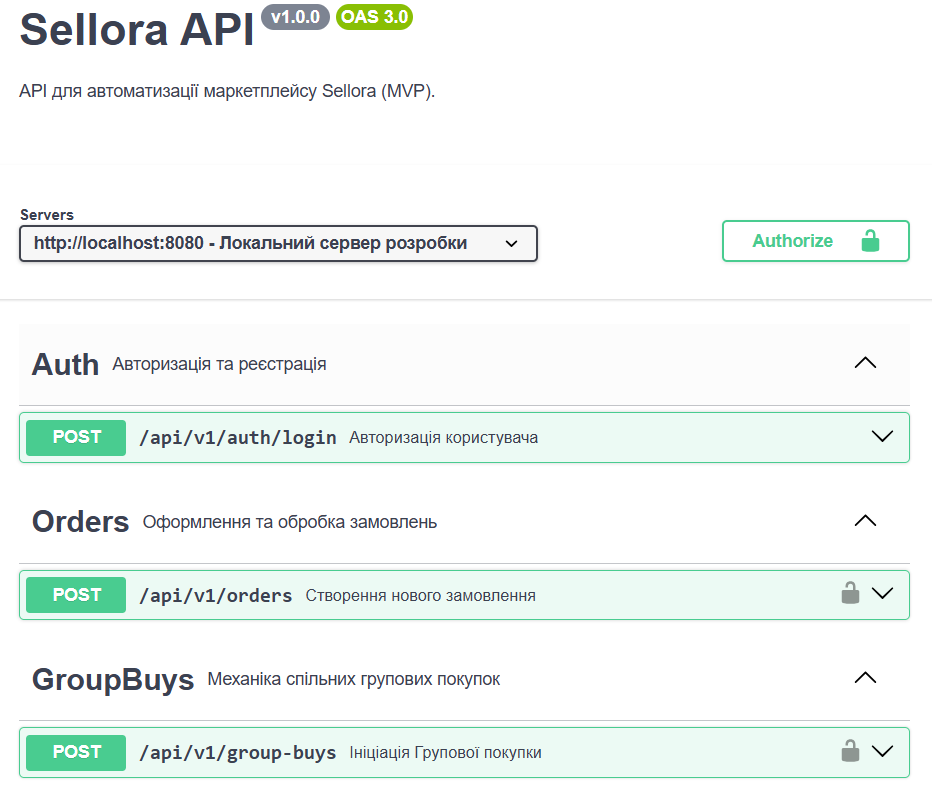
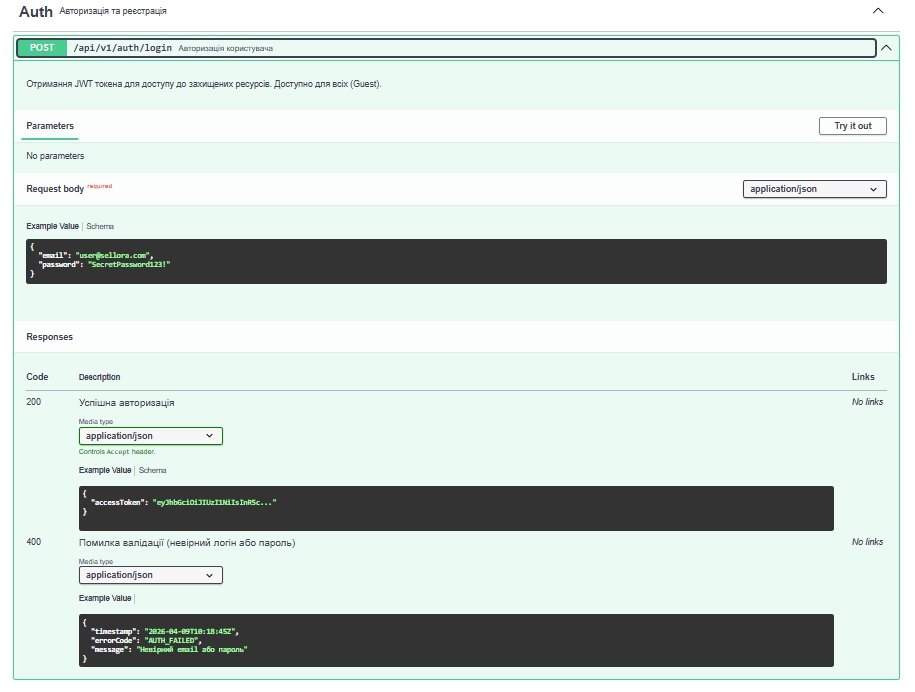

# Інтерактивна документація API

## 1. Файл специфікації (OpenAPI Specification)
Згідно з підходом Design-First, специфікація спроєктована у форматі YAML та зберігається у кореневій директорії репозиторію. Це дозволяє імпортувати контракти у Postman або Swagger Editor для тестування фронтендом.
**Посилання на файл:** [openapi.yaml](../openapi.yaml)

## 2. Опис доступу та інструментарію
* **Локальна адреса:** `http://localhost:8080/swagger-ui/index.html`
* **Опис інструментарію:** Документацію згенеровано автоматично за допомогою бібліотеки `springdoc-openapi-starter-webmvc-ui` для Java (Spring Boot 3). Для опису ендпоінтів та бізнес-обмежень використані стандартні анотації OpenAPI до методів контролерів.

## 3. Скріншоти інтерфейсу Swagger UI

### 3.1 Загальний огляд (Overview)
Демонструє розгорнуті контролери, згруповані за тегами (Auth, Orders, GroupBuys), що відображає цілісність системи.

### 3.2 Деталізація методу (Detailed Endpoint)
Детальний опис POST-запиту `/api/v1/orders`. Чітко видно структуру Request Body (з прикладами заповнених даних, а не порожніми типами) та мапу відповідей (201 Created та 409 Conflict).
