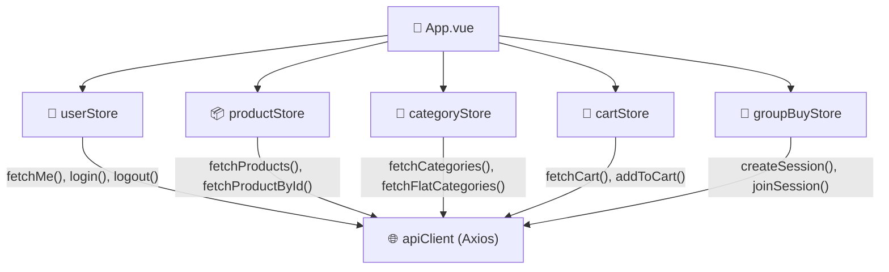

<div align="center">

# Звіт про Frontend-архітектуру проєкту Sellora

### Технічна документація до пояснювальної записки


---

</div>

<br>

## Зміст

1. [Вступ та технологічний стек](#1-вступ-та-технологічний-стек)
2. [Архітектура та структура проєкту](#2-архітектура-та-структура-проєкту)
3. [Управління станом (State Management)](#3-управління-станом-state-management)
4. [Маршрутизація (Routing)](#4-маршрутизація-routing)
5. [Стилізація та UI-компоненти](#5-стилізація-та-ui-компоненти)
6. [Взаємодія з Backend API](#6-взаємодія-з-backend-api)
7. [Висновки](#7-висновки)

<br>

---

<br>

## 1. Вступ та технологічний стек

### 1.1. Обґрунтування вибору технологій

Клієнтська частина маркетплейсу Sellora побудована на базі сучасного реактивного фреймворку **Vue 3** з використанням **Composition API** — декларативного підходу до організації компонентної логіки, що забезпечує чітке розділення відповідальностей та типобезпечну інтеграцію з TypeScript. Вибір Vue 3 обумовлений кількома ключовими архітектурними перевагами:

- **Реактивна система на базі Proxy** — Vue 3 використовує ES2015 Proxy для трекінгу залежностей, що забезпечує автоматичне оновлення DOM при зміні стану без явного виклику `setState` або аналогічних механізмів. Це суттєво спрощує розробку інтерактивних інтерфейсів маркетплейсу, де стан змінюється часто (кошик, фільтри, групові покупки).
- **Composition API** — усі компоненти проєкту використовують синтаксис `<script setup lang="ts">`, що надає доступ до композиційних функцій (`ref`, `computed`, `watch`, `onMounted`) безпосередньо на верхньому рівні. Це дозволяє групувати логіку за функціональним призначенням замість організації за типом опцій (data/methods/computed), що є критично важливим для масштабних компонентів, таких як `CabinetPage.vue` (272 рядки) або `CheckoutForm.vue` (899+ рядків).
- **TypeScript** — проєкт повністю типізований. Конфігурація TypeScript (`tsconfig.app.json`) налаштована з суворими правилами лінтингу: `noUnusedLocals`, `noUnusedParameters`, `noFallthroughCasesInSwitch`. Усі API-інтерфейси, стори та компоненти оперують строго типізованими даними (інтерфейси `ProductApiItem`, `CartItem`, `GroupBuySession`, `UserData` тощо).

### 1.2. Збирач модулів: Vite

Як збирач модулів обрано **Vite** (версія 8.0.x) — інструмент нового покоління, спроєктований спеціально для сучасних ES-модулів. Ключові переваги Vite в контексті Sellora:

| Характеристика | Деталі |
|:---------------|:-------|
| **HMR (Hot Module Replacement)** | Миттєве гаряче перезавантаження модулів без повної пересборки. При зміні файлу `.vue` оновлюється лише конкретний компонент, зберігаючи стан Pinia-сторів та позицію прокрутки |
| **Dev-сервер** | Використовує нативні ES-модулі браузера, що усуває потребу у повній збірці бандлу під час розробки. Час старту dev-сервера — менше секунди навіть для проєктів з десятками компонентів |
| **Production Build** | Використовує Rollup під капотом для оптимізованої tree-shakable продакшн-збірки з автоматичним code-splitting |
| **Плагін Vue** | Підключено `@vitejs/plugin-vue` (v6.0.x), що забезпечує компіляцію SFC (Single File Components) та підтримку `<script setup>` синтаксису |

Конфігурація Vite (`vite.config.ts`) свідомо мінімалістична:

```typescript
import { defineConfig } from 'vite'
import vue from '@vitejs/plugin-vue'

export default defineConfig({
  plugins: [vue()],
})
```

Це рішення обумовлене тим, що основна частина конфігурації делегована спеціалізованим інструментам: PostCSS — для обробки CSS, TypeScript — для типізації, а Tailwind CSS — для генерації утилітарних стилів.

### 1.3. Повний стек залежностей

| Категорія | Бібліотека | Версія | Призначення |
|:----------|:-----------|:-------|:------------|
| **Фреймворк** | Vue | 3.5.x | Реактивний UI-фреймворк |
| **Маршрутизація** | Vue Router | 4.6.x | Клієнтська навігація (SPA) |
| **Стан** | Pinia | 3.0.x | Централізоване управління станом |
| **HTTP-клієнт** | Axios | 1.15.x | Взаємодія з REST API |
| **Дати** | Day.js | 1.11.x | Маніпуляція датами (таймери групових покупок) |
| **Стилі** | Tailwind CSS | 3.4.x | Utility-First CSS-фреймворк |
| **PostCSS** | PostCSS + Autoprefixer | 8.5.x / 10.5.x | Обробка CSS, вендорні префікси |
| **Збирач** | Vite | 8.0.x | Dev-сервер та Production-збірка |
| **Мова** | TypeScript | 6.0.x | Статична типізація |

<br>

---

<br>

## 2. Архітектура та структура проєкту

### 2.1. Загальна файлова структура

Проєкт дотримується Feature-Based архітектури з чітким розмежуванням шарів відповідальності:

```
client/src/
├── api/                    # HTTP-шар (Axios конфігурація та інтерцептори)
│   └── axios.ts            # Централізований API-клієнт
├── assets/                 # Статичні ресурси (зображення, SVG)
├── components/             # Перевикористовувані UI-компоненти
│   ├── cabinet/            # Компоненти кабінету (9 файлів)
│   ├── forms/              # Форми (4 файли)
│   ├── layout/             # Структурні компоненти (6 файлів)
│   ├── modals/             # Модальні вікна (4 файли)
│   └── product/            # Компоненти товарів (6 файлів)
├── constants/              # Словники та статичний контент
│   ├── dictionary.ts       # Централізований словник UI-текстів
│   └── infoContent.ts      # Контент інформаційних сторінок
├── hooks/                  # Композиційні функції (зарезервовано)
├── services/               # Бізнес-логіка (зарезервовано)
├── state/                  # Pinia-стори (5 файлів)
│   ├── userStore.ts        # Стан користувача та магазину
│   ├── productStore.ts     # Стан товарів та фільтрів
│   ├── cartStore.ts        # Стан кошика
│   ├── categoryStore.ts    # Стан категорій
│   └── groupBuyStore.ts    # Стан групових покупок
├── views/                  # Сторінки (Page-level компоненти)
│   ├── HomePage.vue        # Головна сторінка
│   ├── ProductPage.vue     # Сторінка товару
│   ├── CheckoutPage.vue    # Оформлення замовлення
│   ├── OrderPage.vue       # Перегляд замовлення
│   ├── CabinetPage.vue     # Кабінет користувача
│   ├── InfoPage.vue        # Інформаційні сторінки
│   └── NotFound.vue        # Сторінка 404
├── App.vue                 # Кореневий компонент
├── main.ts                 # Точка входу
├── router.ts               # Конфігурація маршрутизації
└── style.css               # Глобальні стилі (Tailwind директиви)
```

### 2.2. Поділ на Views та Components

Архітектура проєкту базується на принципі чіткого розмежування між **Views** (сторінки) та **Components** (перевикористовувані елементи):

**Views** — це сторінки верхнього рівня, що відповідають конкретним маршрутам Vue Router. Кожен View є оркестратором, який:
- Композиціонує Layout-компоненти (`Header`, `Footer`, `Sidebar`)
- Завантажує дані з Pinia-сторів при монтуванні (`onMounted`)
- Синхронізує URL-параметри з фільтрами (`watch(() => route.query, ...)`)
- Передає дані у дочірні компоненти через систему пропсів

**Components** — атомарні та молекулярні UI-елементи, організовані за функціональними доменами:

| Домен | Компоненти | Опис |
|:------|:-----------|:-----|
| **layout/** | `Header`, `Footer`, `Sidebar`, `HeroBanner`, `Breadcrumbs`, `CabinetSidebar` | Структурні елементи макету, що присутні на всіх або більшості сторінок |
| **product/** | `ProductCard`, `ProductDetails`, `ProductGallery`, `ProductGrid`, `ProductTabs`, `RelatedProducts` | Компоненти відображення товарів — від мініатюрної картки до повної сторінки з галереєю |
| **modals/** | `AuthModal`, `CartModal`, `GroupModal`, `ReviewModal` | Модальні вікна, що рендеряться поверх основного контенту з backdrop-overlay |
| **forms/** | `CheckoutForm`, `CheckoutSummary`, `AddProductForm`, `CreateStoreForm` | Складні форми з валідацією, багатокроковою навігацією та інтеграцією з API |
| **cabinet/** | `CabinetCategories`, `CabinetOrders`, `CabinetStoreOrders`, `CabinetGroupBuys`, `CabinetSettings`, `CabinetPromoCodes`, `CabinetRequisites`, `CabinetShippingCarriers`, `CabinetStores` | Компоненти адміністративного кабінету, підключені через систему вкладок |

### 2.3. Приклади ключових компонентів

#### Модальне вікно авторизації (`AuthModal.vue`)

Компонент реалізує двопанельний інтерфейс «Вхід / Реєстрація» з перемикачем вкладок. Архітектурні особливості:

- **Реактивні форми** — використовує `reactive()` для двосторонньої прив'язки полів (`loginForm`, `registerForm`)
- **Валідація в реальному часі** — порівняння паролів під час введення з візуальним індикатором невідповідності (зміна кольору бордера на `red-400`)
- **Інтеграція з Pinia** — після успішної авторизації викликає `userStore.fetchMe()` для оновлення глобального стану
- **Делегування закриття** — використовує систему emits (`@close`, `@login-success`) для сповіщення батьківського компонента

#### Картка товару (`ProductCard.vue`)

Компонент-адаптер, що нормалізує різнорідні API-відповіді у єдину модель відображення через `computed()`:

- **Нормалізація даних** — функція `item` (computed) обробляє варіативність полів API (`standardPrice` / `price`, `title` / `name`, `groupTargetSize` / `groupTotal`) та приводить їх до єдиного інтерфейсу
- **Оптимістичне оновлення UI** — при натисканні «Додати в обране» значок серця змінюється миттєво (`localIsFavorite`), а у випадку помилки API повертається до попереднього стану (rollback-патерн)
- **Багаторежимність** — один компонент працює у трьох режимах: каталог (з бейджем групової покупки), кабінет продавця (з кнопками управління) та спрощений режим (`simple` проп)
- **Lazy loading зображень** — атрибут `loading="lazy"` на тегу `` для відкладеного завантаження зображень товарів, що знаходяться за межами viewport

#### Сторінка кабінету (`CabinetPage.vue`)

Найскладніший View проєкту, що реалізує систему вкладок через синхронізацію з URL-параметрами:

- **URL-driven tabs** — активна вкладка зберігається як query-параметр `?tab=orders`, що забезпечує збереження стану при навігації «Назад» та можливість прямих посилань на конкретні розділи
- **Рольова модель** — адміністративні вкладки (`stores`, `categories`, `shipping-carriers`, `promo-codes`) доступні лише при `userStore.user?.role === 'ADMIN'`
- **Каскадне завантаження** — при завантаженні сторінки послідовно отримуються: дані користувача → дані магазину → товари магазину, з відстеженням через ланцюг `watch()`

<br>

---

<br>

## 3. Управління станом (State Management)

### 3.1. Архітектура Pinia

Для управління глобальним станом додатку використовується **Pinia** (v3.0.x) — офіційна бібліотека управління станом для Vue 3, що замінила Vuex. Вибір Pinia обумовлений:

- **Нативна підтримка Composition API** — стори визначаються як композиційні функції з `defineStore()`, що органічно інтегрується з `<script setup>` синтаксисом
- **Повна типізація TypeScript** — на відміну від Vuex, Pinia забезпечує автоматичне виведення типів без додаткових декларацій
- **Відсутність мутацій** — стан змінюється через прямі присвоєння (`ref.value = newValue`) або через `$patch()`, що спрощує код та зменшує кількість boilerplate
- **Модульність** — кожен стор є незалежним модулем, що може бути завантажений лише тоді, коли він потрібен

### 3.2. Карта сторів

Проєкт містить п'ять Pinia-сторів, кожен з яких відповідає за конкретний домен бізнес-логіки:



### 3.3. Детальний аналіз кожного стору

#### 3.3.1. `userStore` — стан користувача та магазину

**Файл:** `src/state/userStore.ts` (222 рядки)

Центральний стор авторизації, що зберігає дані поточного користувача та його магазину (для ролі SELLER).

**Стан (State):**

| Поле | Тип | Призначення |
|:-----|:----|:------------|
| `user` | `UserData \| null` | Об'єкт користувача (id, email, role, avatarUrl тощо) |
| `isAuthenticated` | `boolean` | Прапорець авторизації |
| `sellerStore` | `SellerStore \| null` | Дані магазину продавця (id, name, slug, status, rating) |
| `isAuthModalOpen` | `boolean` | Глобальний прапорець для відкриття модалки авторизації з будь-якого місця |
| `settings` | `UserSettings \| null` | Налаштування користувача (email-нотифікації) |
| `isCreatingStore` | `boolean` | Індикатор завантаження для операцій зі створення/оновлення магазину |
| `isLoadingStore` | `boolean` | Індикатор завантаження даних магазину |

**Ключові дії (Actions):**

- `fetchMe()` — перевірка авторизації через endpoint `GET /auth/me`. Викликається при ініціалізації додатку в `main.ts` **до монтування роутера**, що гарантує коректну роботу Navigation Guards
- `login(userData)` / `logout()` — синхронна зміна стану + асинхронний запит `POST /auth/logout` для видалення HTTP-only cookie
- `fetchUserStore(userId)` — завантаження даних магазину для конкретного користувача
- `createStore()` / `updateStore()` / `deleteStore()` — повний CRUD для магазинів з обробкою конфліктів (HTTP 409 — наявність товарів)
- `markAsJoinedLocally(uuid)` / `isJoinedLocally(uuid)` — ізольоване зберігання стану участі в групових покупках через `localStorage` з сегментацією за email

**Архітектурний патерн:** Стор реалізує патерн **Optimistic State Initialization** — при завантаженні додатку стан `isAuthenticated` встановлюється через виклик `fetchMe()` ще до монтування Vue Router, що запобігає миготінню захищених сторінок.

#### 3.3.2. `productStore` — стан каталогу товарів

**Файл:** `src/state/productStore.ts` (260 рядків)

Найбільш функціонально насичений стор, що управляє каталогом, фільтрацією, пагінацією та CRUD-операціями з товарами.

**Стан (State):**

| Поле | Тип | Призначення |
|:-----|:----|:------------|
| `products` | `ProductApiItem[]` | Масив товарів каталогу (публічний) |
| `myProducts` | `ProductApiItem[]` | Масив товарів конкретного мерчанта (кабінет) |
| `currentProduct` | `ProductApiItem \| null` | Деталі одного товару (сторінка товару) |
| `totalElements` | `number` | Загальна кількість товарів (для пагінації) |
| `favoritesCount` | `number` | Лічильник обраних товарів |
| `filters` | `ProductFilters` (reactive) | Об'єкт фільтрів: `categoryId`, `keyword`, `minPrice`, `maxPrice`, `status`, `groupMode`, `storeId`, `onlyFavorites`, `sortBy`, `sortDir`, `page`, `size` |

**Пагінація:** Стор реалізує **Infinite Scroll** патерн — при `filters.page === 0` масив товарів замінюється повністю, при `page > 0` нові товари додаються в кінець існуючого масиву (`[...products.value, ...newProducts]`). Це забезпечує безперервне прокручування каталогу без втрати попередньо завантажених товарів.

**Додаткові можливості:**
- `uploadImage(file)` — завантаження зображень товарів через `multipart/form-data` з адаптивним парсингом відповіді (підтримка рядка, `{ url }` та довільного об'єкта)
- `addToFavorites()` / `removeFromFavorites()` — управління списком обраного з оптимістичним оновленням лічильника

#### 3.3.3. `cartStore` — стан кошика

**Файл:** `src/state/cartStore.ts` (234 рядки)

Стор кошика з підтримкою мультимагазинної логіки.

**Архітектурні особливості:**

- **Групування за магазинами** — `computed` властивість `groupedItems` автоматично групує товари кошика за `merchantId`, формуючи структуру `Record<number, GroupedStore>`. Це дозволяє відображати товари різних продавців у окремих блоках
- **Обмеження вибору одним магазином** — бізнес-правило: при оформленні замовлення можна вибрати товари лише з одного магазину. Властивість `selectedMerchantId` блокує вибір товарів з інших магазинів з підтвердженням (`confirm()`) про скидання поточного вибору
- **Реактивний підрахунок суми** — `selectedTotalAmount` (computed) перераховує суму лише для обраних товарів у реальному часі
- **Автоматична очистка** — `cleanupSelection()` видаляє зі стану вибору ID товарів, які були видалені з кошика на бекенді

#### 3.3.4. `categoryStore` — стан категорій

**Файл:** `src/state/categoryStore.ts` (94 рядки)

Стор для деревоподібної та плоскої структури категорій.

Підтримує два формати даних:
- `categories` (ієрархічний) — отримується через `GET /categories/tree` для сайдбару з вкладеними підкатегоріями (акордеон-навігація)
- `flatCategories` (плоский) — отримується через `GET /categories?page=0&size=1000` для випадаючих списків у формах (наприклад, `AddProductForm`)

#### 3.3.5. `groupBuyStore` — стан групових покупок

**Файл:** `src/state/groupBuyStore.ts` (128 рядків)

Стор для унікальної бізнес-логіки групових покупок — ключової відмінної риси Sellora.

**Бізнес-логіка:**

- `createSession(payload)` — створення нової сесії групової покупки з повним набором даних доставки та оплати. Після успішного створення автоматично оновлює масив `mySessions`
- `joinSession(uuid, payload)` — приєднання до існуючої сесії за UUID
- `fetchMySessions()` — отримання всіх активних сесій поточного користувача через `GET /group-buy/sessions/user`
- `isJoined(uuid)` — перевірка участі через серверний масив (без localStorage), що забезпечує консистентність між пристроями

### 3.4. Ініціалізація сторів

Точка входу `main.ts` реалізує **асинхронну ініціалізацію** додатку:

```typescript
const app   = createApp(App)
const pinia = createPinia()
app.use(pinia)

async function initApp() {
  const userStore = useUserStore()
  // Чекаємо перевірку сесії ДО запуску роутера
  await userStore.fetchMe()
  app.use(router)
  app.mount('#app')
}

initApp()
```

Цей підхід вирішує класичну проблему **race condition** між Navigation Guard та завантаженням даних авторизації: роутер підключається лише після того, як стан авторизації вже визначений, що гарантує коректну роботу `meta.requiresAuth` на захищених маршрутах.

<br>

---

<br>

## 4. Маршрутизація (Routing)

### 4.1. Конфігурація Vue Router

Маршрутизація реалізована через **Vue Router 4** (`createRouter`, `createWebHistory`) з використанням HTML5 History API, що забезпечує «чисті» URL-адреси без символу `#`.

**Таблиця маршрутів:**

| Шлях | Компонент | Завантаження | Опис |
|:-----|:----------|:-------------|:-----|
| `/` | `HomePage` | Eager | Головна сторінка з каталогом |
| `/product/:id` | `ProductPage` | Eager | Сторінка деталей товару (динамічний параметр) |
| `/checkout` | `CheckoutPage` | Eager | Оформлення замовлення |
| `/order/:id` | `OrderPage` | Eager | Перегляд замовлення |
| `/cabinet` | `CabinetPage` | Eager | Кабінет (захищений маршрут) |
| `/info/:section?` | `InfoPage` | **Lazy** | Інформаційні сторінки |
| `/:pathMatch(.*)*` | `NotFound` | Eager | Сторінка 404 (catch-all) |

### 4.2. Ліниве завантаження (Lazy Loading)

У проєкті реалізовано **вибіркове** ліниве завантаження. Маршрут `/info/:section?` використовує динамічний імпорт:

```typescript
{
  path: '/info/:section?',
  name: 'InfoPage',
  component: () => import('./views/InfoPage.vue')
}
```

Цей підхід виокремлює `InfoPage.vue` та його залежність `infoContent.ts` (6 КБ статичного контенту) в окремий chunk, що не завантажується при першому відвідуванні сайту. Це оптимізує розмір основного бандлу (initial bundle), оскільки інформаційні сторінки відвідуються рідше за каталог або сторінку товару.

Решта критичних маршрутів (`HomePage`, `ProductPage`, `CheckoutPage`, `CabinetPage`) завантажуються eager — негайно, оскільки їх ймовірність відвідування при типовому сценарії користування маркетплейсом є високою, і затримка при переході була б неприйнятною з точки зору UX.

### 4.3. Захист маршрутів (Navigation Guards)

Реалізовано глобальний `beforeEach` guard для захисту маршрутів, що потребують авторизації:

```typescript
router.beforeEach((to, _from, next) => {
  if (to.meta.requiresAuth) {
    const userStore = useUserStore()
    if (!userStore.isAuthenticated) {
      return next('/')
    }
  }
  next()
})
```

Наразі захищеним є лише маршрут `/cabinet` (`meta: { requiresAuth: true }`). При спробі неавторизованого доступу користувач перенаправляється на головну сторінку. Інстанціювання `useUserStore()` відбувається всередині guard-функції, що гарантує доступність Pinia-інстансу на момент виклику.

### 4.4. Управління прокруткою (Scroll Behavior)

Роутер налаштований з кастомною поведінкою прокрутки:

```typescript
scrollBehavior(_to, _from, savedPosition) {
  if (savedPosition) {
    return savedPosition         // Повернення «Назад» → попередня позиція
  } else {
    return { top: 0, behavior: 'smooth' } // Новий маршрут → прокрутка вгору
  }
}
```

Це забезпечує природну поведінку при навігації: при переході на нову сторінку — прокрутка вгору з плавною анімацією, при натисканні «Назад» — повернення до збереженої позиції.

<br>

---

<br>

## 5. Стилізація та UI-компоненти

### 5.1. Підхід Utility-First (Tailwind CSS)

Для стилізації інтерфейсу використовується **Tailwind CSS 3.4.x** з парадигмою **Utility-First** — замість написання кастомних CSS-класів, стилі описуються безпосередньо в HTML-розмітці через композицію утилітарних класів. Цей підхід має кілька критичних переваг у контексті розробки маркетплейсу:

**Консистентність дизайну.** Tailwind CSS надає обмежену, заздалегідь визначену шкалу значень для відступів (кратні 4 px), кольорів, шрифтів, теней тощо. Це виключає ситуації, коли різні розробники використовують різні значення для ідентичних елементів. Наприклад, усі картки проєкту використовують `rounded-2xl` (16 px), а всі кнопки — `rounded-xl` (12 px).

**Нульова специфічність CSS.** Відсутність каскадних CSS-класів усуває проблеми з непередбачуваною специфічністю селекторів — одну з найпоширеніших проблем масштабних CSS-кодобаз. Кожен компонент повністю описує свій вигляд локально, без залежності від глобальних стилів.

**Dead Code Elimination.** Tailwind CSS у production-збірці автоматично видаляє всі невикористані утилітарні класи через PurgeCSS, що вбудований у Tailwind. Конфігурація content-шляхів (`./index.html`, `./src/**/*.{vue,js,ts,jsx,tsx}`) забезпечує сканування лише релевантних файлів.

### 5.2. Responsive Design (Mobile-First)

Проєкт дотримується підходу **Mobile-First**: базові стилі описують мобільну версію, а адаптації для більших екранів додаються через Tailwind-брейкпоінти:

| Брейкпоінт | Мінімальна ширина | Приклад використання у проєкті |
|:-----------|:-----------------|:-------------------------------|
| (base) | 0 px | Однокоолонковий layout, вертикальні стеки |
| `sm:` | 640 px | Двоколонкова сітка карток, горизонтальний footer |
| `md:` | 768 px | Горизонтальний header, двоколонкова структура info-сторінок |
| `lg:` | 1024 px | Sidebar + Content layout, трьохколонкова сітка товарів |
| `xl:` | 1280 px | Трьохколонкова сітка в кабінеті |

**Приклад адаптивного Layout (HomePage):**

```html
<main class="flex-1 w-full max-w-[1536px] mx-auto
             px-4 md:px-6
             py-4 md:py-8
             flex flex-col lg:flex-row
             gap-6 lg:gap-8">
```

Цей код створює: на мобільних — вертикальний стек з відступами 16 px, на десктопах — горизонтальний layout (sidebar + content) з відступами 24 px.

### 5.3. Мобільна навігація

Для мобільних пристроїв реалізовано **off-canvas меню фільтрів** (`Sidebar.vue`), що працює як slide-in панель:

- Тригер: кнопка «Фільтри та Категорії» на головній сторінці (`lg:hidden`)
- Поведінка: при відкритті — фіксоване позиціонування з backdrop-overlay (`fixed inset-0 bg-black/60 backdrop-blur-sm`)
- Закриття: клік по overlay (`@click.self`), кнопка «×», або автоматично після вибору категорії / застосування фільтра

### 5.4. Глобальний CSS

Файл `style.css` містить лише три Tailwind-директиви:

```css
@tailwind base;
@tailwind components;
@tailwind utilities;
```

Це свідомий архітектурний вибір: весь кастомний CSS описується через Tailwind-утиліти або через `<style scoped>` секції окремих компонентів. Scoped-стилі використовуються лише для випадків, неможливих через утиліти:

- Кастомні `::webkit-scrollbar` стилі (Sidebar)
- Keyframe-анімації (slide-fade для Hero-банера, fade для тост-повідомлень)
- Приховання нативних спін-кнопок `input[type="number"]`

### 5.5. Конфігурація Tailwind

Файл `tailwind.config.js` використовує стандартну конфігурацію Tailwind без кастомних розширень теми:

```javascript
export default {
  content: [
    "./index.html",
    "./src/**/*.{vue,js,ts,jsx,tsx}",
  ],
  theme: {
    extend: {},
  },
  plugins: [],
}
```

Кастомні дизайн-токени (фірмові кольори фонів `#0f1117`, `#1c1f2a`, шрифти `Unbounded`, `Onest`) задаються безпосередньо через arbitrary values Tailwind: `bg-[#0f1117]`, `font-['Onest']`. Цей підхід було обрано для збереження гнучкості без необхідності підтримувати окремий конфігураційний файл зі значеннями дизайн-токенів.

<br>

---

<br>

## 6. Взаємодія з Backend API

### 6.1. HTTP-клієнт (Axios)

Взаємодія з серверною частиною реалізована через бібліотеку **Axios** (v1.15.x) з централізованою конфігурацією у файлі `src/api/axios.ts`.

**Конфігурація інстансу:**

```typescript
export const apiClient: AxiosInstance = axios.create({
  baseURL: 'http://localhost:8080/api/v1',
  timeout: 10000,
  headers: {
    'Content-Type': 'application/json',
  },
  withCredentials: true,
})
```

| Параметр | Значення | Обґрунтування |
|:---------|:---------|:-------------|
| `baseURL` | `http://localhost:8080/api/v1` | Версіонований базовий URL API-сервера |
| `timeout` | `10000` (10 секунд) | Запобігання зависанню запитів при проблемах з мережею |
| `Content-Type` | `application/json` | Стандартний формат обміну даними |
| `withCredentials` | `true` | **Критичний параметр** — дозволяє браузеру автоматично прикріплювати HTTP-only cookies (зокрема `accessToken`) до кожного запиту |

### 6.2. Автентифікація: Cookie-based (HttpOnly)

Проєкт використовує **Cookie-based автентифікацію** замість класичного підходу з JWT у заголовку `Authorization: Bearer`. Токен доступу (`accessToken`) зберігається у **HttpOnly cookie**, що встановлюється сервером при успішному логіні.

**Переваги цього підходу:**

- **Захист від XSS** — HttpOnly cookie недоступний через `document.cookie` або будь-який JavaScript-код, що унеможливлює крадіжку токена через XSS-вразливість
- **Автоматична передача** — параметр `withCredentials: true` на рівні Axios забезпечує автоматичне прикріплення cookie до кожного запиту без додаткової логіки на фронтенді
- **Прозорість для розробника** — фронтенд-код не маніпулює токенами напряму. Немає потреби в `localStorage.setItem('token', ...)` або `axios.defaults.headers.common['Authorization'] = ...`

### 6.3. Обробка помилок: Response Interceptor

Центральний елемент надійності системи — глобальний **Response Interceptor**, що перехоплює відповіді з кодом `401 Unauthorized`:

```typescript
apiClient.interceptors.response.use(
  (response) => response,
  async (error) => {
    if (error.response?.status === 401) {
      // 1. Ігноруємо 401 від /auth/logout (запобігання рекурсії)
      if (requestUrl.includes('/auth/logout')) {
        return Promise.reject(error)
      }

      // 2. Ленивий імпорт userStore (запобігання циклічним залежностям)
      const { useUserStore } = await import('../state/userStore')
      const userStore = useUserStore()

      // 3. Скидання стану авторизації + відкриття модалки логіну
      userStore.$patch({
        user: null,
        isAuthenticated: false,
        sellerStore: null,
        isAuthModalOpen: true,
      })

      // 4. Редірект із захищених сторінок
      if (protectedPaths.some(p => window.location.pathname.startsWith(p))) {
        window.location.href = '/'
      }

      // 5. Маркування помилки як оброблену
      return Promise.reject({ ...error, isHandled: true })
    }
    return Promise.reject(error)
  }
)
```

**Архітектурні рішення в інтерцепторі:**

1. **Запобігання рекурсії** — запити до `/auth/logout` виключені з обробки 401, оскільки сам logout може повернути 401 (expired cookie), що створило б нескінченний цикл
2. **Ленивий імпорт (dynamic import)** — `await import('../state/userStore')` розриває потенційну циклічну залежність `axios.ts → userStore.ts → axios.ts`, яка виникає при статичному імпорті
3. **Прапорець `isHandled`** — розширення об'єкта помилки прапорцем `isHandled: true` дозволяє компонентам (наприклад, `ProductCard.vue`) розрізняти оброблені 401-помилки від інших та не показувати зайвих алертів

### 6.4. Мапа API-ендпоінтів

На основі аналізу всіх сторів та компонентів, фронтенд взаємодіє з наступними ендпоінтами:

| Метод | Ендпоінт | Стор / Компонент | Опис |
|:------|:---------|:-----------------|:-----|
| `POST` | `/auth/login` | `AuthModal` | Авторизація |
| `POST` | `/auth/register` | `AuthModal` | Реєстрація |
| `POST` | `/auth/logout` | `userStore` | Вихід (видалення cookie) |
| `GET` | `/auth/me` | `userStore` | Перевірка поточної сесії |
| `GET` | `/products` | `productStore` | Каталог з фільтрами та пагінацією |
| `GET` | `/products/:id` | `productStore` | Деталі товару |
| `POST` | `/products` | `productStore` | Створення товару |
| `PUT` | `/products/:id` | `productStore` | Оновлення товару |
| `DELETE` | `/products/:id` | `productStore` | Видалення товару |
| `PATCH` | `/products/:id/status` | `productStore` | Зміна статусу товару |
| `GET` | `/products/merchant/:id` | `productStore` | Товари мерчанта |
| `POST` | `/uploads/image` | `productStore` | Завантаження зображень |
| `GET` | `/categories/tree` | `categoryStore` | Дерево категорій |
| `GET` | `/categories` | `categoryStore` | Плоский список категорій |
| `POST` | `/categories` | `categoryStore` | Створення категорії |
| `DELETE` | `/categories/:id` | `categoryStore` | Видалення категорії |
| `GET` | `/cart` | `cartStore` | Отримання кошика |
| `POST` | `/cart` | `cartStore` | Додавання до кошика |
| `PATCH` | `/cart/:id/quantity` | `cartStore` | Зміна кількості |
| `DELETE` | `/cart/:id` | `cartStore` | Видалення з кошика |
| `DELETE` | `/cart` | `cartStore` | Очищення кошика |
| `POST` | `/group-buy/sessions` | `groupBuyStore` | Створення сесії |
| `POST` | `/group-buy/sessions/:uuid/join` | `groupBuyStore` | Приєднання до сесії |
| `GET` | `/group-buy/sessions/:uuid` | `groupBuyStore` | Деталі сесії |
| `GET` | `/group-buy/sessions/user` | `groupBuyStore` | Мої сесії |
| `POST` | `/favorites/:id` | `productStore` | Додати до обраного |
| `DELETE` | `/favorites/:id` | `productStore` | Видалити з обраного |
| `GET` | `/stores/user/:id` | `userStore` | Магазин за userId |
| `POST` | `/stores/create` | `userStore` | Створення магазину |
| `PUT` | `/stores/:id` | `userStore` | Оновлення магазину |
| `DELETE` | `/stores/:id` | `userStore` | Видалення магазину |
| `PATCH` | `/stores/:id/status` | `userStore` | Зміна статусу магазину |
| `GET` | `/user-settings/me` | `userStore` | Налаштування користувача |
| `PUT` | `/user-settings/me` | `userStore` | Оновлення налаштувань |
| `PUT` | `/users/me` | `userStore` | Оновлення профілю |
| `PATCH` | `/users/me/password` | `userStore` | Зміна пароля |

### 6.5. Локалізація (i18n)

Проєкт реалізує базову систему локалізації через об'єкт-словник `DICT` (`constants/dictionary.ts`). Усі UI-тексти (навігація, кнопки, мітки, повідомлення, форми) централізовані в одному файлі та використовуються через інтерполяцію: `{{ DICT.nav.search }}`, `{{ DICT.actions.buy }}`.

Цей підхід дозволяє:
- Уникнути «захардкоджених» рядків у шаблонах компонентів
- Легко замінити всі тексти при перекладі на іншу мову
- Підтримувати єдиний тон та стиль UI-текстів

<br>

---

<br>

## 7. Висновки

Frontend-архітектура маркетплейсу Sellora побудована на базі сучасного стеку технологій (Vue 3 + TypeScript + Vite + Pinia + Tailwind CSS), що забезпечує:

1. **Масштабованість** — модульна структура з п'ятьма незалежними Pinia-сторами та 29 компонентами, розподіленими за функціональними доменами, дозволяє безконфліктне розширення функціональності
2. **Продуктивність розробки** — Vite HMR, Tailwind Utility-First та Composition API мінімізують час між написанням коду та побаченням результату
3. **Безпека** — Cookie-based автентифікація з HttpOnly прапорцем, глобальна обробка 401-помилок, захист маршрутів через Navigation Guards
4. **Адаптивність** — Mobile-First підхід забезпечує коректне відображення на всіх пристроях від 320 px до 1536 px
5. **Підтримуваність** — повна TypeScript-типізація, централізований словник текстів, єдина система дизайн-токенів

Загальний обсяг клієнтського коду складає **29 Vue-компонентів**, **5 Pinia-сторів**, **1 централізований HTTP-клієнт** та **7 сторінок (Views)**, що формують повнофункціональний SPA-додаток маркетплейсу з підтримкою стандартних та групових покупок.

<br>

